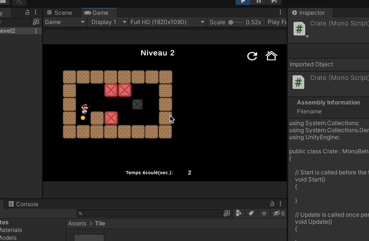

# SokoBan

Tags: C#, Unity  
Status: Done

# **Game Name:** Sokoban

**Type of Game:** *2D, puzzle video game, single player*

**Description:** *The game we intend to implement is inspired by Sokoban, a puzzle game invented in Japan. In this game, the player must arrange boxes on target squares. They can move in four directions and push (but not pull) one box at a time. Once all the boxes are placed, the level is completed, and the player moves on to the next, generally more difficult, level.*

**Mechanisms to Implement:**

- [ ]  *Model the game board, boxes, and player*
- [ ]  *Manage player movement*
- [ ]  *Manage box movement*
- [ ]  *Handle collisions between the player and boxes*
- [ ]  *Handle collisions between the player and the wall*
- [ ]  *Handle collisions between the boxes and the wall*
- [ ]  *Add audio effects for obstacles that cannot be passed*
- [ ]  *Add audio effects when the player moves a box*
- [ ]  *Add a timer to record the best time for a level*
- [ ]  *Add a menu with "play", "level", and "exit" buttons*
- [ ]  *Add a menu with all levels*
- [ ]  *Add difficulty by limiting the number of moves possible*

## Implementation Details

- **Developed box management**: Implemented the **`Crate`** class to manage interactions and movements of the boxes in the game.
- **Implemented target detection**: Designed the **`Dot`** class to detect and manage the positions of the target squares where the boxes must be placed.
- **Coordinated game logic**: Created the **`Game`** class to orchestrate the main game mechanisms, including level management and interactions between elements.
- **Managed game states**: Developed the **`GameManager`** class to control the game states, such as starting, pausing, and ending the games.
- **Designed the user interface**: Used the **`MenuController`** class to manage interactions with the main menu, providing a smooth and intuitive user experience.
- **Controlled player movements**: Programmed the **`Player`** class to manage the character's movements, including controls and interactions with boxes and walls.

